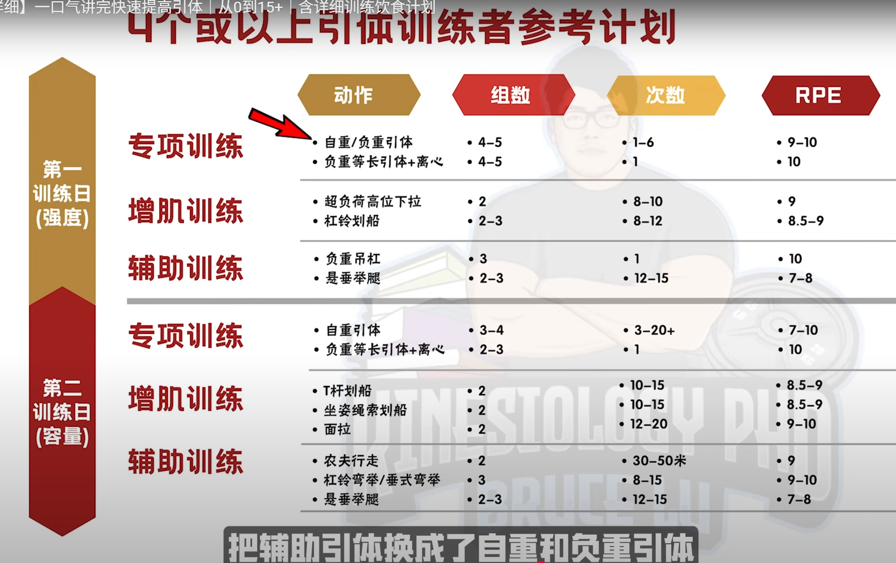
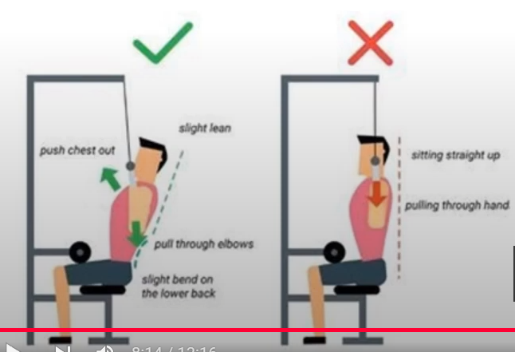
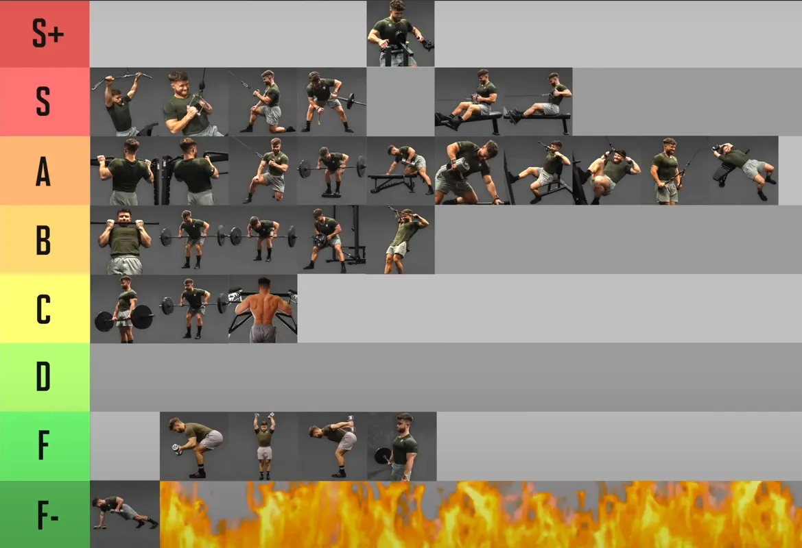

1. 背部——硬拉，杠铃划船，器械划船，引体向上，——用引体向上作为热身
    High row machine 斜前方拉下来的机器， eugene teo用的是cable版本， 李茶也很推荐_考虑替代cable，
    *到 pull up和back页面找寻动作*

    优先选择用**Selectorized**，但是考虑到多样性刺激，如果被占用，就使用plate load形式的，差别不太大。
    而且plate 更容易锻炼我的弱侧

2. 肱二头肌

3. face pull

# 💪Pull

## pull  肌肉负责控制，不是爆发力

* push 是远离身体，所以很安全，需要爆发力
* pull 拉向身体，会撞到自己，所以需要的不是爆发力，是控制力
* 主要肌肉是背部（背部很复杂）和肱二头肌
* 采用健美训练方法，多次数

## 【全网最详细】一口气讲完快速提高引体｜从0到15+

### 背部肌肉种类

* **背阔肌**: 引体向上、高位下拉、划船（杠铃划船、哑铃划船）。
* **竖脊肌**: 硬拉、山羊挺身、超人（superman）练习。
* **斜方肌**: 分上、中、下三部分。
* **菱形肌**

划船优先夹肩胛骨，而不是拉到最后才夹。

##  pull 不一样

######  (Rowing, Deadlift, Chin-Up) （划船、硬拉、引体向上）

These are the only exercises where you don't push close to your limit. Do more sets to get the work done. See it more as “strength practice” than all-out lifting. But to make these effective at increasing strength and size, control the eccentric by lowering slowly for about 2-3 seconds. Try to accelerate as much as possible on the concentric, lifting phase.
*这些是唯一不需要你逼近极限的练习*。多做几组就能达到效果。*与其说是全力以赴的举重，不如把它看作是“力量练习”*。但为了有效地增加力量和肌肉块头，*需要控制离心收缩，缓慢降低身体约2-3秒*。在*向心收缩和举重阶段，尽量加速*。

##  背部

## Get A Huge Back With Only 3 Exercises 

eugene teo

0-3 RIR：  **0-3 RIR** 是指 **Reps in Reserve**，也就是**保留次数**。它是一种衡量训练强度的常用方法，表示你在完成一组动作后，距离力竭（即无法再用标准姿势完成一次动作）还有多少次的余力。

1. warm up with pull Downs(下拉)
2. A1 pull-ups   4sets  of 8-15 reps 60s rest 0-3 RIR,  ——下降时要控制，很慢很慢，本质上就是慢速离心收缩，刺激肌肉，不是顶峰pause。
3. B1 Lat prayer   4sets  of 8-15 reps，60s rest, weight 47 0-3 RIR——*很像斜前方拉下来的机器，李茶也也很推荐*
4. C1  smith machine deficit flexion row   4sets  of 10-15 reps 90s rest,  0-3 RIR

## 白天手術房晚上健身房

### 肱二头肌

1. 如果时间不够，就不练
2. 哑铃锤式弯举

### 背阔肌

作者有两个版本，重制版更加分析了下拉

背阔肌唯一：**引体向上**，完美符合背阔肌功能

如果拉不起来：就**单手**滑轮**下拉**，或者水平。

~~哑铃杠铃划船统统拿掉~~——技术难

双手下拉1.5倍肩宽

##  Thib

| 类别               | Primary                                                      | Secondary                                                    | Auxiliary                                                    | Remedial                                                     |
| ------------------ | ------------------------------------------------------------ | ------------------------------------------------------------ | ------------------------------------------------------------ | ------------------------------------------------------------ |
| 上背部、三角肌后束 | 反手引体向上及其变化动作，正手引体向上及其变化动作，胸部支撑划船，俯身杠铃划船，T杠划船 | 单臂哑铃划船，T杠下拉及其变化动作，钢索坐姿划船及其变化动作，墙角划船，胖子引体向上（反式划船），坐姿对颈绳子握柄划船 | 直臂下拉，钢索仰卧直臂上拉，高位滑轮交叉划船，低位滑轮交叉划船，机器坐姿划船，机器背阔肌下拉，俯身侧平举，机器反飞鸟，胸部支撑上斜俯身侧平举 | 胸部支撑上斜哑铃耸肩，坐姿钢索耸肩（肩胛骨缩回），上斜俯卧平举 |

##  盖伊三人组：一个动作

背部：一致推荐 *引体向上*

##  Athlean-X

###  back

best：weighted pull up， bb row(担心下背部，用chest support 替代), 

almost best：Meadows Row, **1 arm high cable row**，lat pulldown，dead row

###  Trap 

best：  Trap Bar Shrugs

almost best： Face Pulls w/ Overhead Extension, ~~Wrap Around Rows~~, DB/BB Shrugs, Cable Angled Shrugs

##  The Best Damn Back and Biceps Workout 最佳背部和二头肌锻炼

Based on the results of this experiment, I bet the following would be one kick-ass workout that'd target the lats, mid, and lower traps as well as the biceps. Enjoy!
根据这次实验的结果，我敢打赌，下面的训练计划一定会非常有效，不仅能锻炼到二头肌，还能锻炼到背阔肌、斜方肌中部、下部和中部。好好享受吧！

- Weighted **Pull Up**, Weighted Chin Up, or Weighted Parallel Grip Pull Up
  负重引体向上、负重引体向上或负重平行握力引体向上
- Dumbbell Bent Over Row or Weighted Feet Elevated Inverted Row
  哑铃俯身划船或负重双脚抬高倒立划船
- **Dumbbell Elbows Out Chest Supported Row** or **Prone Trap Raise**
  哑铃肘外展胸部支撑划船或俯卧斜方肌平举
- Deadlift or Rack Pull
  硬拉或架上拉
- Barbell Curl or EZ-Bar Curl
  杠铃弯举或 EZ-Bar 弯举

##  The Best And Worst Back Exercises (Ranked By Science)

> S:  Wide-Grip lat Pulldown, Neutral-Grip lat Pulldown, Meadows Row， chest support row（健身房有），cable row
>
> A：wide-grip pull-up,  1 arm row
>
> 

