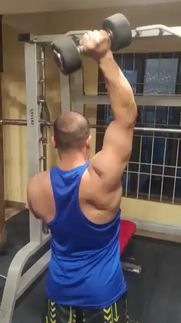
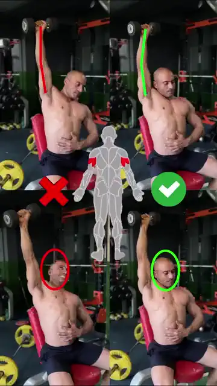

# PUSH

## DB Shoulder Press

## Triceps A: DB extension

* overhead

## Triceps B:  cable pulldown  

### **(or 窄距平板卧推)** 

* non overhead
* *cable 优点：移动度好，对手肘好；移动轨迹长让肌肉更长的收缩*
* 直杠或者w杠对**肩膀**和手腕友好。

## (Optional) Chest  

1. 上斜卧推
2. dips——注意肩部收紧
3. 俯卧撑——不负重 不追求数量

## Snatch

## Face Pull

3x15+

## Farmer  Walk

3x60s+腹肌

* 体姿
* thib 推荐
* 大部分时候用传统的方式，其他变种偶尔玩玩

## 前臂

## 山羊挺身

## 腹肌

