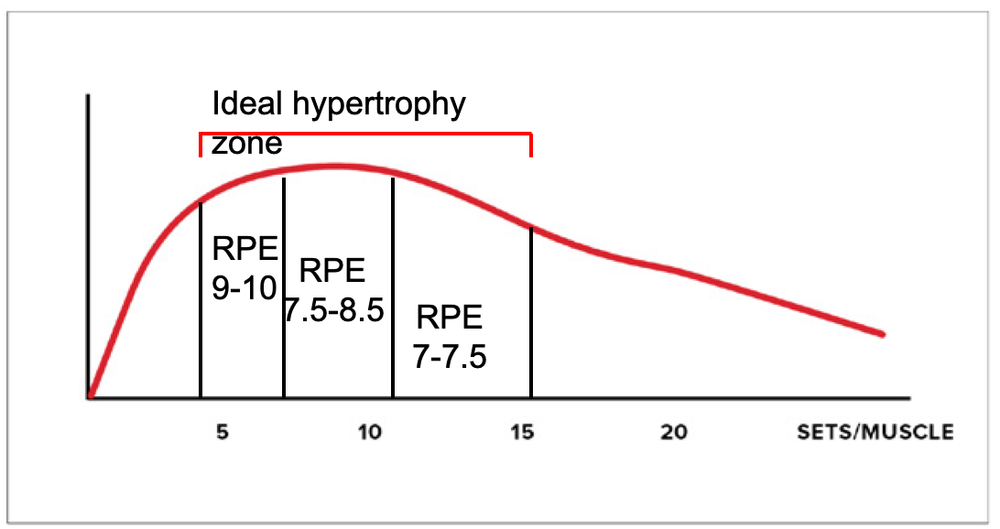

# 对自然举重者的建议

“自然”指的是目前不使用类固醇或其他合成代谢药物。

## Recommendation for naturals  

 **For each program or phase, select one dominance between volume and intensiveness. Don’t use a high level of both 对于每个项目或阶段，在训练量和强度之间选择一个主导因素。不要同时使用高水平的训练量和强度。**

Note that it is technically possible to go for moderate volume and moderate intensity. BUT I find that most who try to do that quickly ramp up one or two of the variables and reach an excessive training stress level.
请注意，从技术上讲，**中等训练量和中等强度是可行的。但**我发现，大多数尝试这样做的人很快就会增加一两个变量，**最终**达到*过度*的训练压力水平。

## Recommendation for naturals  

 **Even if you pick a « volume » dominance, still stay more conservative than enhanced lifters when it comes to overall session volume 即使你选择以“训练量”为主导，在整体训练量方面，仍然比增强型举重运动员更加保守**

Training stress has systemic effects (cortisol and adrenaline production). If you keep volume/muscle low but do a boatload of volume in your session you could negate your gains. For example, if you do 6-8 sets per muscle (which is low) but train 4-5 muscles directly, you still get to 24-40 work sets in your workout which is too much for most.
训练压力会产生系统性影响（皮质醇和肾上腺素的产生）。如果你保持较低的训练量/肌肉量，但在训练中却投入大量的训练量，你可能会抵消你的训练成果。例如，如果你每块肌肉做6-8组（这个量很低），但直接训练4-5块肌肉，你仍然会在训练中完成24-40组，这对大多数人来说都太多了。

Normally for a natural trainee, I recommend using a total of 4-5 exercises in a workout (out of which only 2-3 are big demanding lifts) which an overall volume in the 8-16 **work** **sets** range for the session.
通常对于自然训练者，我建议在一次训练中总共进行 4-5 个练习（其中只有 2-3 个是要求较高的举重动作），整个训练的总量在 8-16 个**工作****组**范围内。

Naturals can likely go up to 20 total sets per session (but should not exceed 10-12 for a single muscle), especially if they have good recovery capacities and low life stress. But only if intensiveness is kept moderate.
自然训练者每次训练最多可以做20组（但单个肌肉群不应超过10-12组），尤其是在恢复能力强、生活压力较小的情况下。但前提是强度要适中。

## Recommendation for naturals  

  **If you want to do more volume per session you must decrease the « secondary stressors » for the session as much as possible, and even then, it should not be done in the long term 如果你想在每次训练中增加训练量，你必须尽可能减少训练中的“次要压力源”，即使这样，也不应长期这样做**

Secondary training stressors are psychological stress, neurological demands, density, and competitiveness.
次要的训练压力源是心理压力、神经需求、密度和竞争力。

If you want to do more than the 16-20 total work sets the limit in a session you should:
如果您想要完成超过 16-20 个工作量所设定的限制，您应该：

1. Use a greater proportion of machine or isolation exercises
    使用更大比例的器械或隔离练习
2. Keep rest intervals longe
    保持较长的休息间隔
3. Stick with exercises and methods you are comfortable with
    坚持你觉得舒服的锻炼方式和方法
4. Don’t try to beat a partner
    不要试图打败伴侣

## Recommendation for naturals  

  **If you used a period of higher training stress it should not be longer than 3-4 weeks and you should follow it by deload for 7-10 days. 如果您采用了较高训练压力的时期，则不应超过 3-4 周，并且您应该在 7-10 天内进行减负荷训练。**

Deloading simply refers to lowering training stress to reduce cortisol and (more importantly), adrenaline. This prevents (or fixes) training burnout/overtraining by helping you re-sensitize the beta-adrenergic receptors.
减负荷简单来说就是降低训练压力，以减少皮质醇和（更重要的是）肾上腺素的分泌。这可以帮助你重新敏感β-肾上腺素受体，从而预防（或修复）训练倦怠/过度训练。

You can deload by lowering any of the 6 training variables that increase overall stress (volume, intensiveness, psychological stress, neurological demands, density, competitiveness). The variables are ranked in order of its impact on training stress (and it’s effectiveness during a deloading phase).
你可以通过降低6个会增加整体压力的训练变量（训练量、训练强度、心理压力、神经系统需求、训练密度、竞争力）中的任何一个来减轻训练负荷。这些变量按其对训练压力的影响（以及在减轻负荷阶段的有效性）排序。

The more severe the « stress period » was, the more you must lower stress during the deload (you might need to lower 3-5 variables).
“压力期”越严重，您在减负期间必须降低的压力就越多（您可能需要降低 3-5 个变量）。

## Recommendation for naturals  

  **Train each muscle (at least indirectly) 2-3 times a week 每周训练每块肌肉 2-3 次（至少间接训练）**

The natural trainee needs the training session to trigger the increase in anabolism that the steroid-user gets around the clock from the products he uses.
自然训练者需要通过训练课程来触发类固醇使用者通过其使用的产品全天候获得的合成代谢的增加。

After a workout, protein synthesis/anabolism is elevated for, at the most, 30-36h.
锻炼后，蛋白质合成/合成代谢最多会升高 30-36 小时。

Training a muscle only once a week is thus suboptimal because you only get 30-36h or enhanced growth out of the 168h of the week.
因此，每周仅训练一次肌肉并不是最理想的，因为在一周的 168 小时中，你只能获得 30-36 小时或增强的增长时间。

If you train a muscle 2-3x per week this goes up to 60-72 or even 90-108h of enhanced anabolism in a specific muscle, leading to faster growth.
如果您每周训练一块肌肉 2-3 次，那么特定肌肉的合成代谢就会增强 60-72 小时甚至 90-108 小时，从而实现更快的生长。

A higher frequency might not be ideal (for hypertrophy… strength is a different story) because you would either not be able to recover fast enough, or don’t provide enough stimulation in a session to trigger growth.
较高的频率可能并不理想（对于肥大而言......力量是另一回事），因为您要么无法足够快地恢复，要么无法在训练中提供足够的刺激来触发生长。

## Recommendation for naturals 

  **Even with an increase in frequency per body part, don’t increase overall frequency unless you use an extreme low volume approach. 即使每个身体部位的频率增加，也不要增加整体频率，除非您使用极低音量的方法。**